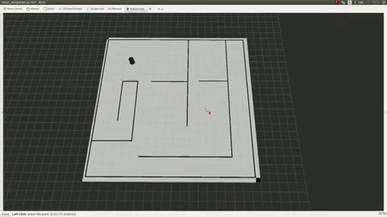
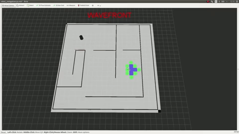
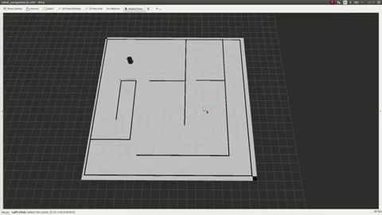

# global_planner_short_path_student
## Description
Use the turtlebot simulator (state) to learn short path algorithm.


## How to use

- Install requirments if needed
```
   sudo apt install ros-jazzy-rmw-cyclonedds-cpp

   sudo apt install ros-jazzy-navigation2
   sudo apt install ros-jazzy-nav2-bringup

   sudo apt install ros-jazzy-turtlebot3-gazebo
```

- Create a Ros workspace and clone the training repo:

```
    mkdir -p ~/ros_planner_ws/src
    cd ~/ros_planner_ws/src
    git clone https://github.com/jacques-saraydaryan/global_planner_short_path_student.git
```

- Export your trainingrepo path
```
    export TRAINING_GLOBAL=<your training repo path>
```

- Start the simulation (set headless:=False fo visualize gazebo gui)

```
    ros2 launch nav2_bringup tb4_simulation_launch.py world:=$TRAINING_GLOBAL/world/baseline.world x_pose:=1.0 y_pose:=1.0 z_pose:=0 map:=$TRAINING_GLOBAL/map/baseline.yaml
```
- Compile the training Repo and start the Node

```
cd ~/ros_planner_ws/src
colcon build --symlink-install --packages-select global_planner_short_path_student
source install/setup.bash
ros2 run global_planner_short_path_student ShortPathMng
```

On the rviz panel click on the publish point button to select a goal on the map. Your algorithm begins


- Tips: you can set the different algorithm by passing parameters to the node:

```
    ros2 run global_planner_short_path_student ShortPathMng --ros-args -p resolution:=1 -p shortPathMethod:='WAVEFRONT' -p inflate_radius:=0.5 -p isLocalPlanner:=True
```

## Customization
Parameters can be modified through the ShortPathMng.py parameters :

```
    
    ros2 run global_planner_short_path_student ShortPathMng --ros-args -p resolution:=1 -p shortPathMethod:='WAVEFRONT' -p inflate_radius:=0.5 -p isLocalPlanner:=True
```
- `resolution` Define the grid resolution factor of the simulation (caution large grid lead to long processing...) 


- `shortPathMethod` :Define the default short path method  (possible 'WAVEFRONT', 'ASTAR', 'DIJKSTRA', 'GREEDY_BEST_FIRST_SEARCH')

- `inflate_radius` Define the inflate radius of obstacles 

- `isLocalPlanner` Activate custom local planner or not


## The job to do 

1 Inflate the obstacles of your map according to the robot radius and the grid resolution
```python
    # **************************************************
    # ***************   INFLATE MAP    *****************
    # **************************************************

    def inflate_map(self,map,map_resolution):
        new_inflated_map=""
        ### TODO
        ### map :original map ( like a grid[][] )
        ### map_resolution :original map resolution (e.g 0.05)
        ###
        ### self.inflate_radius : radius of obstacle inflate (0.3 m)
        ### self.MAP_OBSTACLE_VALUE : value into the map of an obstacle (-100)
        #
        #
        #
        #
        #                       TODO
        #
        #
        #
        #
        ###

        return map
        ## UNCOMMENT LINE BELLOW TO TEST YOUR INFLATED MAP
        # return new_inflated_map
```
2 Complete the files Dijkstra.py to add the Dijkstra short path algorithm
```python
class Dijsktra(AbstractShortPath):
    def __init__(self):
        pass


    def goto(self, source, target, matrix, pub_marker, marker_container):
        prev = {}
        ### TODO
        ###########################################################
        ################### Function Paramters ###################
        ###########################################################
        ### source: coordinate of the robot position source['x'] return the x position, source['y'] return the y position
        ###
        ### target: coordinate of the target position target['x'] return the x position, target['y'] return the y position
        ###
        ### matrix: rescaled map (including obstacles) matrix[i][j] return the value of the cell i,j of the matrix
        ###
        ### elf.MAP_OBSTACLE_VALUE: value of an obstacle into the matrix (-100)
        ###
        ### pub_marker: marker publisher to visualize information into rviz (usage pub_marker.publish(marker_container) )
        ###
        ### marker_container: marker container where where new marker are added as point
        ###
        ###########################################################
        ################### Function Toolboxes ###################
        ###########################################################
        #   # create a visual information
        #   self.createFontierUnitMarker(v, marker_container)
        #
        #    # publish visual information
        #    pub_marker.publish(marker_container)
        #
        #    # create a visual information
        #    self.createClosedMarker(u, marker_container)
        #
        #
        #
        #
        #
        #
        #                       TODO
        #
        #
        #
        #
        #
        #
        ###
        ### prev:  disctionary holding node precedence
        ### CAUTION prev dictionary has to be completed as follow:
        ###
        ### prev[str(v['x']) + '_' + str(v['y'])] = str(u['x']) + '_' + str(u['y'])
        ###
        ### where v['x'] return the x position of the node v in the resized map
        ### where v['y'] return the y position of the node v in the resized map
        return prev
```

3 Complete the files AStar.py to add the AStar short path algorithm
```python
class AStar(AbstractShortPath):
    def __init__(self):
        pass

    def goto(self, source, target, matrix, pub_marker, marker_container):
        prev = {}
        ### TODO
        ###########################################################
        ################### Function Paramters ###################
        ###########################################################
        ### source: coordinate of the robot position source['x'] return the x position, source['y'] return the y position
        ###
        ### target: coordinate of the target position target['x'] return the x position, target['y'] return the y position
        ###
        ### matrix: rescaled map (including obstacles) matrix[i][j] return the value of the cell i,j of the matrix
        ###
        ### elf.MAP_OBSTACLE_VALUE: value of an obstacle into the matrix (-100)
        ###
        ### pub_marker: marker publisher to visualize information into rviz (usage pub_marker.publish(marker_container) )
        ###
        ### marker_container: marker container where where new marker are added as point
        ###
        ###########################################################
        ################### Function Toolboxes ###################
        ###########################################################
        #   # create a visual information
        #   self.createFontierUnitMarker(v, marker_container)
        #
        #    # publish visual information
        #    pub_marker.publish(marker_containers)
        #
        #    # create a visual information
        #    self.createClosedMarker(u, marker_container)
        #
        #
        #
        #
        #
        #
        #                       TODO
        #
        #
        #
        #
        #
        #
        ###
        ### prev:  disctionary holding node precedence
        ### CAUTION prev dictionary has to be completed as follow:
        ###
        ### prev[str(v['x']) + '_' + str(v['y'])] = str(u['x']) + '_' + str(u['y'])
        ###
        ### where v['x'] return the x position of the node v in the resized map
        ### where v['y'] return the y position of the node v in the resized map
        return prev

```

4 Link your global planner to your local planner
```python
 def __init__(self, resolution, shortPathMethod,isLocalPlanner,inflate_radius):
	 ...
	# ------------------#
        # ---- Service -----#
        # ------------------#
        self.local_planner_service =""
        ### TODO
        ### create the link between our navigation ros node and our local_planner
        ### self.local_planner_service: service container to call the local_planner node
        ###
        #
        #
        #
        #
        #                       TODO
        #
        #
        #
        #
        ###
	...
  ```
  
  5 Complete in the case of using your local planner
```python
   def pushGoals(self,mapNode,start,markerArray,isreverted,isPathOnService):
	...
	 if isPathOnService:

		    ### TODO
		    ### call here the local planner service (self.local_planner_service)
		    ### goalQueue: queue of goal to acheive (Posestamped ros message)
		    ###
		    ### self.local_planner_service: service to call the local planner ( TODO need to be created on the ShortPathMng constructor)
		    #
		    #
		    #
		    #
		    #                       TODO
		    #
		    #
		    #
		    #
		    ###
		    print''
```
## Example of results (videos)    
### GREEDY_BEST_FIRST_SEARCH

| Behavior | Result |
| --- | ----------- |
| [](https://www.youtube.com/watch?v=lDA77HuNVHk) | [](https://www.youtube.com/watch?v=lDA77HuNVHk) |
### Wave front
| Behavior | Result |
| --- | ----------- |
| [](https://www.youtube.com/watch?v=O9L5zjO_doc) | [](https://www.youtube.com/watch?v=O9L5zjO_doc) |

### Dijsktra
| Behavior | Result |
| --- | ----------- |
| [](https://www.youtube.com/watch?v=nK7DpX4PoL0) | [](https://www.youtube.com/watch?v=nK7DpX4PoL0) |

 ### A*
 | Behavior | Result |
 | --- | ----------- |
 | [](https://www.youtube.com/watch?v=wf7FvOBaquY) |  [](https://www.youtube.com/watch?v=wf7FvOBaquY) |

